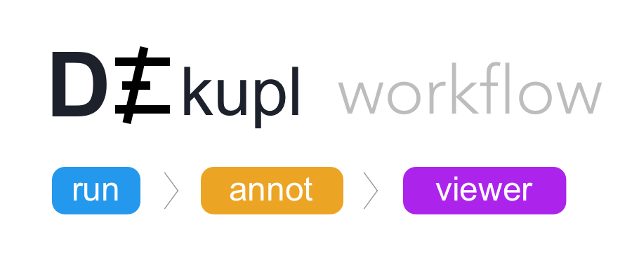

# DE-kupl
Exhaustive capture of biological variation in RNA-seq data through k-mer decomposition (article: https://doi.org/10.1186/s13059-017-1372-2, pre-print: http://biorxiv.org/content/early/2017/06/02/122937).

DE-kupl is a computational protocol that aims to capture all k-mer variation in an input set of RNA-seq libraries. This protocol is composed of four main components :

- **Indexing**: index and count all k-mers (k=31) in the input libraries
- **Filtering**: delete k-mers representing potential sequencing errors or perfectly matching known transcripts
- **Differential Expression (DE)**: select k-mers with significantly different abundance across conditions
- **Extension and annotation**: build k-mer contigs and annotate contigs based on sequence alignment.

## DE-kupl workflow



The DE-kupl project is composed of three sub-modules: 

- **[DE-kupl run](https://github.com/Transipedia/dekupl-run)** which handle the DE-kupl procude from raw FASTQ to the assembly of differentially expressed k-mers. 
- **[DE-kupl annotation](https://github.com/Transipedia/dekupl-annotation)** which annotate DE contigs produced bu DE-kupl run.
- **[DE-kupl viewer](https://github.com/Transipedia/dekupl-viewer)** Interactively visualize annotated dekupl contigs in a Shiny interface.

We recommand to use [conda](https://conda.io/miniconda.html) to install all three submodules using a single command-line :

```
conda install -n dekupl -y -m --override-channels -c transipedia -c bioconda -c conda-forge -c https://repo.anaconda.com/pkgs/main -c https://repo.anaconda.com/pkgs/free -c https://repo.anaconda.com/pkgs/pro dekupl-run dekupl-annotation dekupl-viewer
```

Documentation for each submodule can be found into their respective projects (see above).

Usage example
```
source activate dekupl
dekupl-run --configfile my-config.json  -jNB_THREADS --resources ram=MAX_MEMORY -p
dkpl index -g toy/references/GRCh38-chr22.fa.gz -a toy/references/GRCh38-chr22.gff.gz -i test_index
dekupl-viewer -c ${PWD}/toy/DiffContigsInfos.tsv -s ${PWD}/toy/sample_conditions_full.tsv
```
